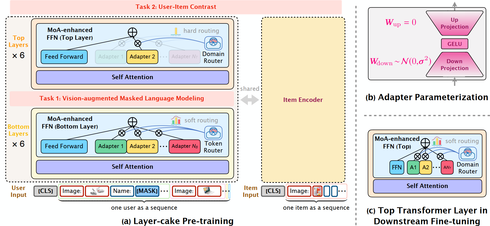
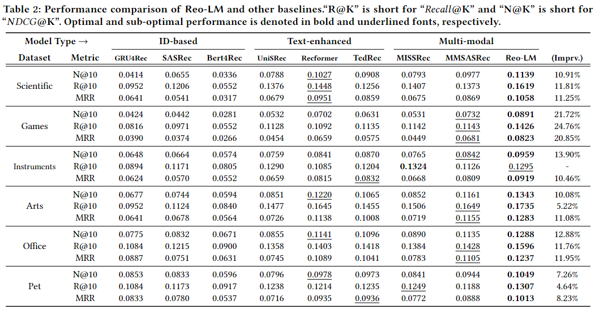

# Reo-LM

This is the official Pytorch implementation for the paper:

> Recommendation-oriented Pre-training for Universal Multi-modal Sequence Representation with Language Models

## Method Overview



## Requirements

```
python>=3.9.13
cudatoolkit>=12.0
torch>=1.13.1
pytorch-lightning>=2.0.2
transformers>=4.36.2
tqdm>=4.64.1
numpy>=1.23.1
```

## Dataset Description

Our experiments are conducted on one assembled upstream pre-training datasets and six downstream fine-tuning datasets.


|   Datasets   |  #Users   |  #Items   | #Img.(Cover./%) |  #Inters   | Avg.SL. |
| :----------: | :-------: | :-------: | :-------------: | :--------: | ------- |
| Pre-training | 3,608,532 | 1,022,309 | 724,562(70.88%) | 33,572,032 | 9.30    |
|  Scientific  |  11,041   |   5,327   |  3,490(65.52%)  |   76,896   | 6.96    |
| Instruments  |  27,530   |  10,611   |  6,289(59.27%)  |  231,312   | 8.40    |
|     Pet      |  47,569   |  37,970   | 30,611(80.62%)  |  420,662   | 8.84    |
|     Arts     |  56,210   |  22,855   | 13,418(58.71%)  |  492,492   | 8.76    |
|    Games     |  55,223   |  17,389   | 14,967(86.07%)  |  496,315   | 8.99    |
|    Office    |  101,501  |  27,932   | 20,542(73.54%)  |  798,914   | 7.87    |

## Quick Start

Considering the requirement of anonymity and the size limitation, we provide the data of the *Scientific* domain and a Reo-LM checkpoint fine-tuned on it for review. 

Our supplementary materials include a directory named `Scientific` and a checkpoint file named `Scientific.ckpt`, please unzip them and put them in the same directory as `test.sh`, then you can run 

```
bash test.sh
```

to check our experimental result on `Scientific` domain.

Further validation and open-source implementation will be available after peer review.

## Overall performance of all methods



## Acknowledgement

- If you have any questions, please feel free to give me your advice.
- Thank you for your reading and guidance.

